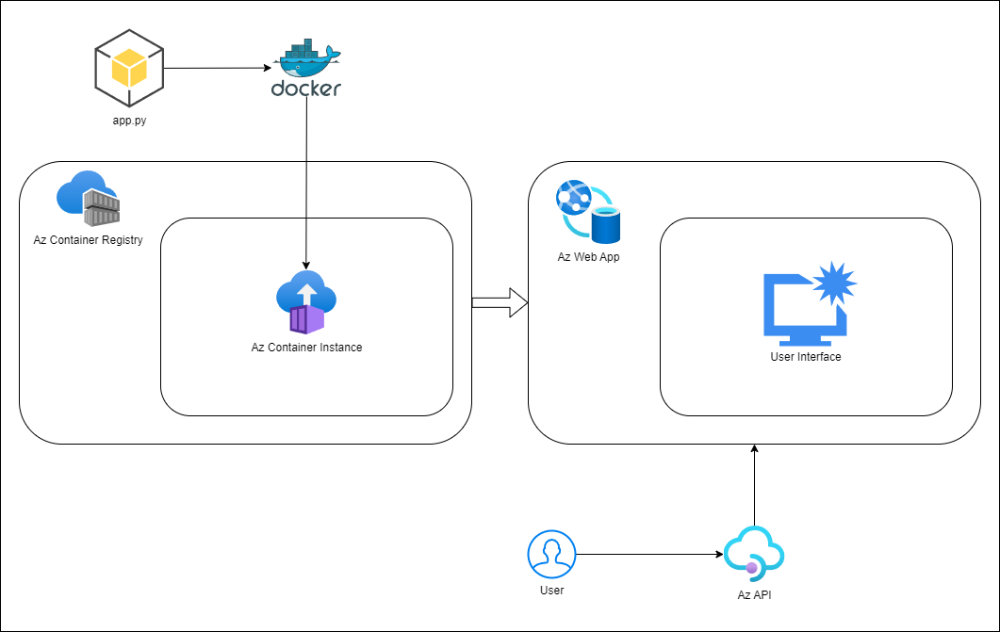

# 🚀 Deploying a Streamlit Web App on Azure with Container Registry

Welcome to the guide on deploying your own Streamlit web app using Azure's Container Registry and Web App services! This step-by-step manual will walk you through the process of creating and pushing a Dockerized Streamlit app to Azure and deploying it using Azure Web Apps. Let's get started! 🎉



---

## Prerequisites 🛠️

1. **Azure Subscription** – Make sure you have an active Azure subscription. If not, [sign up here](https://azure.microsoft.com/en-us/free/).
2. **Docker Installed** – Install Docker on your local machine to build, run, and push the Docker image.
3. **Azure CLI** – You'll need the Azure CLI to interact with your Azure resources.
4. **Streamlit App** – Have a working `app.py`, `requirements.txt`, and `Dockerfile` ready for your Streamlit app.

---

## Step 1: Set Up Azure Resources

### 1.1 Create an Azure Container Registry (ACR) 🏗️
First, you need a container registry to store your Docker images.

1. Log into [Azure Portal](https://portal.azure.com/).
2. In the search bar, type **Container Registry** and click **Create**.
3. Fill in the required details:
   - **Subscription**: Your subscription.
   - **Resource group**: Either create a new one or use an existing one.
   - **Registry name**: Pick a globally unique name (e.g., `template1st1app1v1`).
   - **SKU**: Choose `Basic` unless you have specific needs.
4. Click **Review + Create** and then **Create** to finish.

### 1.2 Create an Azure Web App 🌐
Next, create a Web App to deploy your containerized Streamlit app.

1. In the Azure Portal, search for **Web App** and click **Create**.
2. Fill in the details:
   - **Subscription**: Your subscription.
   - **Resource group**: Use the same resource group as your ACR.
   - **Name**: Choose a name for your web app (e.g., `streamlit-webapp`).
   - **Publish**: Select **Docker Container**.
   - **Operating System**: Choose **Linux**.
   - **Region**: Select the Azure region nearest to you.
3. Click **Review + Create** and then **Create**.

---

## Step 2: Prepare Your Streamlit App Locally

Before deploying to Azure, let's get your Streamlit app working locally with Docker.

### 2.1 Required Files 📂

You will need the following files in your project directory:

#### `app.py`
This is your Streamlit Python script. Here's a minimal example:

```python
import streamlit as st

st.title('Hello, Streamlit!')
st.write('This is a simple Streamlit app running on Azure.')
```

#### `requirements.txt`
List all the Python dependencies here:

```
streamlit
```

#### `Dockerfile`
Your Dockerfile defines how to build your Streamlit app inside a Docker container. Use the following template:

```Dockerfile
# Use the official Python image from Docker Hub
FROM python:3.11-slim

# Set the working directory in the container
WORKDIR /app

# Copy the current directory contents into the container at /app
COPY . .

# Install any needed packages specified in requirements.txt
RUN pip install --no-cache-dir -r requirements.txt

# Expose port 8501 (default port for Streamlit)
EXPOSE 8501

# Run the Streamlit app
CMD ["streamlit", "run", "app.py", "--server.port=8501", "--server.address=0.0.0.0"]
```

### 2.2 Build and Run the Docker Image Locally 🖥️

1. **Build the Docker Image**:
   ```bash
   docker build -t helloworld .
   ```

2. **Run the App Locally**:
   ```bash
   docker run -p 8501:8501 helloworld
   ```
   Now, visit `http://localhost:8501` to see your Streamlit app running.

---

## Step 3: Push the Docker Image to Azure Container Registry (ACR) 🛳️

Now, let’s push the Docker image you created to Azure’s Container Registry.

### 3.1 Login to Azure Container Registry
Use Docker to log in to your Azure Container Registry (ACR):

```bash
docker login template1st1app1v1.azurecr.io
```

You'll be prompted for a username and password, which can be found in the **Access Keys** section of your Container Registry resource in the Azure portal.

### 3.2 Tag the Docker Image

To prepare the image for upload, tag it with your registry's name:

```bash
docker tag helloworld template1st1app1v1.azurecr.io/helloworld:latestv1
```

It's a good habit to version your images (e.g., `latestv1`, `latestv2`, etc.) for easier updates in the future.

### 3.3 Push the Image to Azure

Now push your Docker image to your ACR:

```bash
docker push template1st1app1v1.azurecr.io/helloworld:latestv1
```

Once complete, your image will be stored in Azure Container Registry.

---

## Step 4: Deploy Your Image to Azure Web App 🚀

Now that your image is in Azure Container Registry, it's time to deploy it via Azure Web App.

### 4.1 Configure Azure Web App

1. Go to your **Web App** resource in the Azure Portal.
2. Navigate to **Deployment Center** (under **Deployment** in the side menu).
3. In the **Source** section, select **Azure Container Registry**.
4. In the **Registry** dropdown, select your container registry (`template1st1app1v1.azurecr.io`).
5. In the **Image** field, select `helloworld`.
6. In the **Tag** field, choose the appropriate version (e.g., `latestv1`).
7. Make sure **Admin Credentials** is enabled.
8. Press **Save** to deploy the image.

### 4.2 Access Your App

Once the deployment completes, you can access your web app by navigating to the **URL** provided by the Azure Web App resource. 🎉

---

## Recap 📝

Here's a summary of what we've covered:

1. Created an **Azure Container Registry** to store Docker images.
2. Built and tagged a **Dockerized Streamlit app** locally.
3. Pushed the Docker image to **Azure Container Registry**.
4. Configured **Azure Web App** to deploy the containerized app from ACR.

And that's it! You've successfully deployed a Streamlit app to Azure using Docker and Azure Container Registry. 🎉🌍

---

### Troubleshooting 🔧

- If your app isn't loading, check the **Logs** in your Web App’s **Log Stream**.
- Ensure you've correctly specified the image version (`v1`, `v2`, etc.) in the **Deployment Center**.
- Confirm that **Admin Credentials** are enabled in the Deployment Center for accessing ACR.

Happy coding! ✨